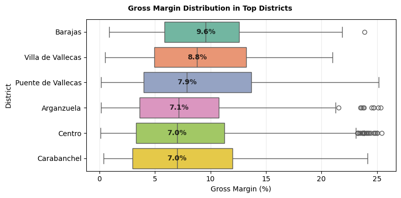
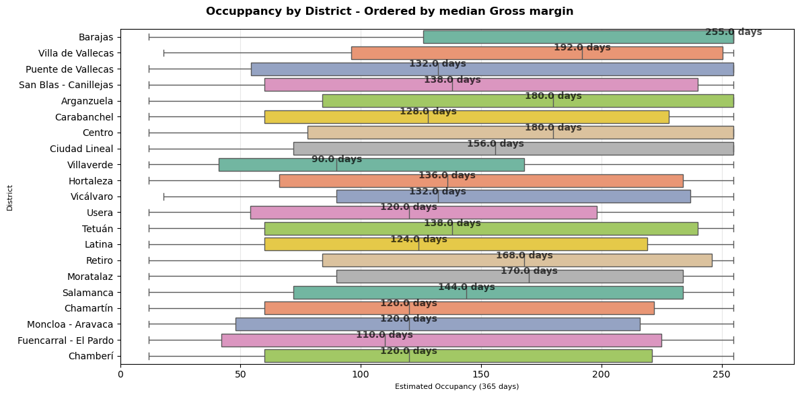
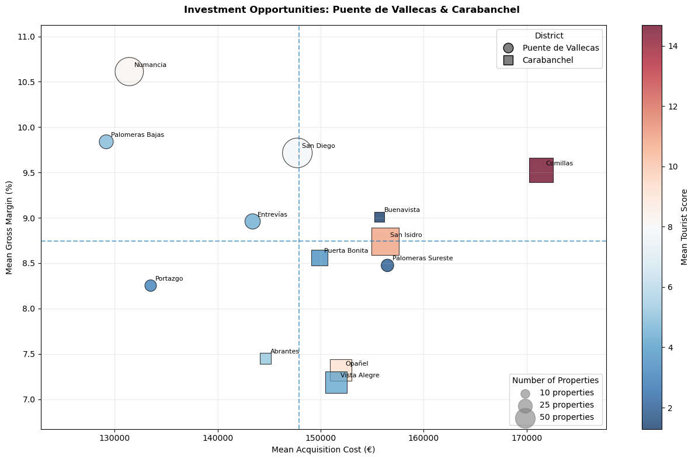

# Madrid Tourist Rental Investment Analysis
> Analysis based on Madrid Airbnb listing data collected in June 2026.
## Project Overview

Management has decided to invest in Madrid and has commissioned an analysis of publicly available data from Airbnb, one of the leading platforms in the short-term rental market.

The objective is to identify the property profiles with the highest commercial potential for tourist rentals and the areas of Madrid where these opportunities are concentrated.

The analysis combines rental market performance data with estimated acquisition costs and location-based indicators to support the property sourcing strategy.

---

## Business Objective

**Identify the property profile or profiles that maximise commercial potential in Madrid's tourist rental market and the main areas where these opportunities are concentrated.**

Three factors were identified as the main profitability drivers:

* **Nightly price:** higher prices increase potential rental income.
* **Occupancy:** more occupied days increase annual revenue.
* **Acquisition price:** lower purchase prices improve investment potential.

---

## KPIs

The analysis evaluates properties using:

* **Estimated annual occupancy:** expected occupied days per year.
* **Nightly price (€):** Airbnb listed price per night.
* **Estimated acquisition price:** estimated size × average district price per m², applying a **25% negotiation discount**.
* **Estimated annual gross revenue:** calculated from nightly price and expected occupancy.
* **Gross margin:** yearly revenue expected without considering financial costs & taxes.

The metrics do not represent a complete financial model including operating costs, taxes or financing.

---

## Data & Storage

The project combines three main data sources:

* **Airbnb listings:** 2026 Madrid listing-level data from [Inside Airbnb](https://insideairbnb.com/get-the-data/?utm_source=chatgpt.com).
* **Residential prices:** average district price per m² from Idealista market data (`preciom2_madrid_2025.csv`).
* **Tourist points of interest:** coordinates of 45 major attractions (`poi_madrid.csv`).

Data was centralised using **SQLite (`sqlite3`)** in `mercado_inmobiliario.db`.

---

## Data Preparation & Feature Engineering

The dataset was prepared to create a reliable reference sample and generate variables required for the investment analysis.

### Data Quality Filters

The following records were excluded:

* Listings with less than **10 months of history**, improving the reliability of occupancy estimates.
* Nightly prices outside the **€20–€1,000** range.
* Listings with occupancy below the **25th percentile**, as the analysis focuses on commercially stronger reference properties.
* Extreme values above the **99th percentile** for `beds`, `bedrooms` and `bathrooms`, with an additional maximum of **12 beds**.

Missing values in `beds`, `bedrooms` and `bathrooms` were imputed using properties with the same `accommodates` capacity, applying the **mode when it represented at least 50% of observations and the median otherwise**.

### New Analytical Variables

Several variables required for the analysis were not available in the original data:

* **Estimated property size:** a proxy derived from available property characteristics, used to approximate acquisition cost.
* **Estimated annual gross revenue:** calculated from nightly price and occupancy, with usage adjustments for specific private and shared room configurations to avoid overestimating potential revenue.
* **Tourist Attractiveness Score (0–100):** generated from the distance to 45 major points of interest using the Haversine formula and exponential distance decay.

The tourist score function is available in `src/preprocessing.py` as `tourist_score_0_100`.

---

## Repository Structure

```text
data/
├── raw/
notebooks/
reports/
├── graphics/
docs/
├── maps/
src/
README.md
requirements.txt
```
`docs/` contains the GitHub Pages site and interactive maps.
The SQLite database used during the analysis is not included in the repository due to its file size (~78 MB). The repository contains the main raw CSV sources used in the analysis.

## Exploratory Data Analysis Findings

### General Gross Margin Analysis

**Insight 1 - Centro Offers the Strongest Overall Investment Profile**

The analysis shows that the strongest investment opportunities are concentrated around **Entire home/apt properties**, particularly those with **2 bedrooms and capacity for 4+ guests**.

At the district level, the best opportunities depend on the balance between gross margin, tourism attractiveness and acquisition cost:

* **Centro** offers the strongest and most reliable combination of gross margin and tourism attractiveness.
* **Arganzuela** and **Puente de Vallecas** show the highest gross margin potential, although Puente de Vallecas has a smaller reference sample.
* **Carabanchel** offers a strong balance between gross margin, tourism attractiveness and low acquisition cost.
* **Barajas** and **Villa de Vallecas** show high gross margin potential but low tourist attractiveness, making them less suitable when tourism demand is a key investment requirement.

---

### Top Districts Gross Margin Analysis

**Insight 1 - Puente de Vallecas leads the Gross Margin 75th Percentile**

The six districts with the best overall combination of **gross margin, tourist attractiveness, occupancy and acquisition cost** were selected for deeper analysis.



* **Barajas** maintains the highest median gross margin and relatively stable performance, although its profile is less suitable for tourism-focused investment.
* **Puente de Vallecas** combines a strong median gross margin with a high P75, while also showing some tourism potential.
* **Arganzuela, Centro and Carabanchel** show similar performance patterns, with **Centro** providing the most reliable evidence due to its much larger reference sample.

<br>

**Insight 2 - Entire Homes Dominate the Highest-Margin Configurations followed by 2 Bedrooms and 4/4+ Guests**

An **isolated property feature ranking by gross margin** was created to identify which property features perform best within each district. The analysis breaks down highest gross margin by **room type, number of bedrooms, beds and guest capacity**.

The summarized table below shows the best property features of the first two districts by Gross Margin.

| District       | Dimension      | Value           | Listings | Occupancy | Gross Margin |
| -------------- | -------------- | --------------- | -------: | --------: | -----------: |
| **Arganzuela** | Room type      | Entire home/apt |      471 |       186 |    **8.66%** |
| **Arganzuela** | Guest capacity | 3 guests        |       59 |       222 |    **9.32%** |
| **Arganzuela** | Bedrooms       | 2 bedrooms      |      140 |       177 |    **9.06%** |
| **Arganzuela** | Beds           | 4 beds          |       46 |       185 |   **10.44%** |
| **Barajas**    | Room type      | Entire home/apt |       41 |       228 |   **10.75%** |
| **Barajas**    | Guest capacity | 5+ guests       |       14 |       255 |   **11.30%** |
| **Barajas**    | Bedrooms       | 2 bedrooms      |       14 |       255 |   **13.34%** |
| **Barajas**    | Beds           | 5+ beds         |        4 |       242 |   **13.18%** |


The highest-margin configurations are predominantly **Entire home/apt** properties, although the optimal combination of size and capacity varies by district. Results from configurations with very small samples should be interpreted cautiously.

<br>

**Insight 3 - Puente de Vallecas and Arganzuela Lead in Potential Gross Margin, While Centro Offers the Strongest Evidence**

A deeper gross margin analysis was developed by filtering the top property features on each District. The analysis shows the potential gross margin that districts can actually reach with these configurations.

| District               | Percentile    | Gross Margin | Properties | Total |
| ---------------------- | ------------- | -----------: | ---------: | ----: |
| **Centro**             | P75 · Top 25% |   **13.83%** |        251 |   994 |
| **Centro**             | P90 · Top 10% |   **17.97%** |        100 |   994 |
| **Arganzuela**         | P75 · Top 25% |   **16.14%** |         21 |    83 |
| **Arganzuela**         | P90 · Top 10% |   **20.94%** |          9 |    83 |
| **Puente de Vallecas** | P75 · Top 25% |   **17.59%** |          6 |    22 |
| **Puente de Vallecas** | P90 · Top 10% |   **22.43%** |          3 |    22 |
| **Carabanchel**        | P75 · Top 25% |   **14.35%** |         20 |    77 |
| **Carabanchel**        | P90 · Top 10% |   **18.60%** |          8 |    77 |
| **Barajas**            | P75 · Top 25% |   **16.72%** |          7 |    27 |
| **Barajas**            | P90 · Top 10% |   **18.36%** |          4 |    27 |
| **Villa de Vallecas**  | P75 · Top 25% |   **15.24%** |          2 |     8 |
| **Villa de Vallecas**  | P90 · Top 10% |   **17.04%** |          1 |     8 |


**Puente de Vallecas** shows the strongest gross-margin potential, reaching 22.43% among its top 10% of properties, followed by **Arganzuela** at 20.94% and **Carabanchel** with 18.60%. **Centro** offers a more reliable reference due to its much larger sample, while the higher values in smaller districts should be interpreted with greater caution.

**Barajas and Villa de Vallecas** combine attractive performance metrics with low tourist attractiveness and limited samples, so they are not recommended when tourism appeal is a mandatory investment criterion.

---

### Occupancy Analysis

**Insight 1 - Centro, Puente de Vallecas & Carabanchel Offer the Strongest Occupancy & Gross Margin Combination**

The occuppancy analysis evaluates opportunities from a **lower-risk perspective**, focusing on properties capable of maintaining relatively high annual occupancy.



The strongest combination of **occupancy and gross margin** is found in **Centro, Puente de Vallecas and Carabanchel**.

Other districts such as **Barajas, Villa de Vallecas and Arganzuela** also show high occupancy, while **Retiro and Moratalaz** provide comparatively stable occupancy but lower gross margin potential.

The occupancy data has a maximum of **255 days**, reflecting the upper limit present in Airbnb's estimated occupancy variable.

---

### Neighbourhood Opportunity Analysis among selected Districts

**Insight 1 - Numancia, San Diego & San Isidro Offers the Strongest Tourism Potential and Low Acquisition Cost Combination**

**Puente de Vallecas and Carabanchel** were selected for a more granular neighbourhood analysis because they combine **low acquisition costs with attractive tourism potential**.



The analysis identifies:

* **Best overall opportunities:** Numancia, San Diego and San Isidro.
* **Lowest acquisition cost:** Numancia, Palomeras Bajas, Portazgo, Entrevías and San Diego.
* **Highest tourist attractiveness:** Comillas, San Isidro and Opañel.

For an investment strategy prioritising **tourism potential and low acquisition cost**, **Numancia, San Diego and San Isidro** offer the strongest combination.

If acquisition cost is less restrictive, **Comillas, San Isidro and Opañel** become more attractive alternatives.

<br>

**Insight 2 - Top Configurations Favor 1-Bedroom Entire Homes in Selected Neighbourhoods**

A configuration-level ranking was created to identify specific combinations of neighbourhood, room type and property characteristics.

A minimum of **5 properties per configuration** was required to reduce the impact of highly unstable small samples.

The top configurations by gross margin were:

| Neighbourhood     | Property profile                                 | Median Gross margin | Properties |
| ----------------- | ------------------------------------------------ | ------------------: | ---------: |
| **Comillas**      | Entire home/apt · 1 bedroom · 4 guests · 2 beds  |          **15.00%** |          8 |
| **Numancia**      | Entire home/apt · 1 bedroom · 3 guests · 2 beds  |          **14.65%** |          7 |
| **Puerta Bonita** | Entire home/apt · 1 bedroom · 4 guests · 2 beds  |          **14.53%** |          6 |
| **Vista Alegre**  | Entire home/apt · 1 bedroom · 4 guests · 2 beds  |          **12.36%** |          6 |
| **San Diego**     | Entire home/apt · 2 bedrooms · 4 guests · 2 beds |          **11.63%** |         11 |

The results reinforce the broader analysis: **Entire home/apt** is present in **18 of the top 20 configurations**, with **1-bedroom properties accommodating around 4 guests** appearing particularly frequently.

Because individual configurations have smaller samples, these results should be considered **supporting evidence rather than standalone investment recommendations**.

---

## Interactive Maps

Interactive heatmaps were developed for a better visualization of rental opportunities across Madrid. Different versions of the geographic analysis are available through GitHub Pages:

- [Madrid Opportunities by Gross Margin Heatmap](https://jordipsans.github.io/madrid-tourist-rental-opportunity-analysis/)
- [Madrid High-Occupancy Opportunities Heatmap](https://jordipsans.github.io/madrid-tourist-rental-opportunity-analysis/)
- [Madrid Opportunities in Puente de Vallecas & Carabanchel Heatmap](https://jordipsans.github.io/madrid-tourist-rental-opportunity-analysis/)

## Gross Margin Calculator Tool

The calculator estimates the potential gross margin for a specific property configuration.

A prototype **custom gross margin calculator** is also available in `src/preprocessing.py`. The notebook `03_Analisis.ipynb` contains a use example. 

The calculator is an **academic prototype** rather than a production investment tool. A real-world implementation would require additional business inputs and validation from the valuation and investment teams.

---

## Recommendations

Based on the combination of gross margin, estimated occupancy, acquisition cost, tourist attractiveness and sample size, the analysis suggests the following investment priorities:

1. **Prioritise Entire home/apt listings** with approximately **1–2 bedrooms and capacity for 4+ guests**, as these profiles consistently appear among the strongest-performing configurations.

2. **Focus the initial search on Puente de Vallecas and Carabanchel** when acquisition cost is a key constraint. These districts combine relatively low estimated acquisition costs with attractive gross margin and tourism potential.

3. **Consider Centro for lower analytical risk.** Its larger reference sample provides stronger evidence for the identified property profiles, despite its higher acquisition cost.

4. **Prioritise Numancia, San Diego and San Isidro** when looking for neighbourhoods that balance tourism attractiveness and acquisition cost.


5. **Treat small-sample opportunities as candidates for further validation**, rather than direct investment recommendations. Property-level due diligence and local market validation would be required before acquisition.

---

## Future Work
<br>

The current analysis provides a screening framework rather than a complete real-estate investment model. Future work could extend it by:

* Incorporating **operating expenses, taxes, maintenance, management fees and financing** to estimate net cash flow and a more complete investment return.
* Improving the **property-size and acquisition-cost estimates** using actual property-level market data.
* Adding **time-series analysis** to evaluate seasonal demand and changes in rental performance.
* Incorporating **regulatory and licensing constraints** affecting tourist rentals in Madrid.
* Validating the most promising configurations against **additional data sources**, such as real-estate listings and transaction data.
* Developing the **gross margin calculator into an interactive decision-support tool** with additional investment parameters.


## Conclusions
<br>

The analysis points towards a clear investment profile:

> **Entire home/apt properties, generally around 1–2 bedrooms and capacity for 4+ guests, located in districts combining reasonable tourist attractiveness with low acquisition costs.**

Among the analysed areas, **Centro** provides the strongest evidence and tourism profile, while **Puente de Vallecas and Carabanchel** offer particularly attractive opportunities from a **cost-to-potential perspective**.

At neighbourhood level, **Numancia, San Diego and San Isidro** emerge as the most attractive candidates when balancing acquisition cost and tourism potential.

The results also show that **gross margin alone is not sufficient to select an investment area**. Combining gross margin with occupancy, tourist attractiveness, acquisition cost and sample size produces a more robust framework for identifying potential investment opportunities.